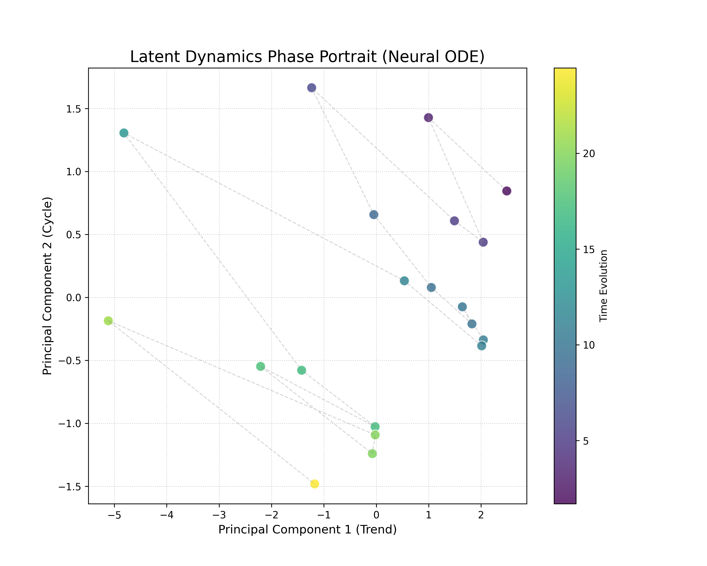

<p align="right">
  <a href="README_zh.md">中文</a> | <strong>English</strong>
</p>

# DeepM3: Dynamic System-2 Scaling for Recommender Systems

<div align="center">
  
</div>


*Figure: DeepM3 architecture. A continuous-time user dynamics model (System 1)
handles the majority of requests under strict latency constraints, while an
adaptive router selectively escalates uncertain cases to a reasoning agent
(System 2).*


> **"Reasoning as a Service"**: A hybrid recommender system harmonizing **Neural ODEs (System 1)** with **LLM Reasoning (System 2)**. 
> Designed for high-throughput production environments with built-in **Budget Control**, **Feature Flags**, and **Observability**.

## 📊 Live System Monitoring (Built-in)

DeepM3 ships with a pre-configured Prometheus + Grafana stack. 
Below are real snapshots under **Mixed Traffic Stress Test** (50% Cold Start / 50% Hot Cache), demonstrating system stability.

| **Stratified Latency (Fast vs Slow)** | **Cache Efficiency (Exact 50%)** |
| :---: | :---: |
|  |  |
| *Distinct separation between System 1 (<5ms) and System 2 (~2.4s)* | *Stable hit rate validating deterministic caching logic* |

<div align="center">
  <p><strong>Stable Throughput (QPS)</strong></p>
  
</div>

---

## 🏗 Architecture Overview

This design addresses a core production challenge: 
serving the majority of traffic with strict latency budgets,
while preserving reasoning capability for long-tail uncertainty cases.

DeepM3 follows a **System 1 / System 2** cognitive architecture:

### 1. System 1: Continuous-Time Dynamics (Neural ODE)
Unlike traditional RNNs, DeepM3 models user preference evolution as a continuous trajectory in latent space.

<div align="center">
  
</div>

*Figure: Visualization of user latent dynamics. The **Attractor** (spiral center) represents the user's stable interest core, while the trajectory points capture real-time intent shifts governed by the Neural ODE equation.*

### ⚡ L1 Visual Semantic Cache (Multimodal Optimization)

To handle the high computational cost of visual encoders (e.g., CLIP) without sacrificing latency, DeepM3 implements a **Level-1 Visual Cache**:

- **Mechanism**: Hashes image inputs (MD5) to serve as distinct semantic keys.
- **Benefit**: 
    - **Cache Hit**: Returns pre-computed visual tags instantly (<1ms).
    - **Cache Miss**: Routes to the Vision Tool only for novel inputs.
- **Observability**: Real-time Hit/Miss rates are tracked via Prometheus (`visual_cache_ops`).

### 2. System 2: Reasoning Agent (Slow Path)
An agent-based reasoning module (DeepSeek/OpenAI) is activated only for long-tail/uncertain queries. It performs chain-of-thought reasoning to resolve multimodal conflicts.

### 3. Adaptive Router with Budget Control
* **Policy**: Routes based on predictive entropy and feature conflicts.
* **Governance**: Implements a **Token Bucket** algorithm to strictly limit System 2 invocations, ensuring **Cost Predictability**.


---

## 🚀 Quick Start (Reproducible)

The entire system (API + Prometheus + Grafana) can be deployed with **one command**.  
**No external API key is required** (Runs in Mock Mode by default for zero-cost reproduction).

### 1. Start Services

```bash
git clone [https://github.com/Liz915/DeepM3.git](https://github.com/Liz915/DeepM3.git)
cd DeepM3

# Build and start all containers
docker-compose up -d --build
```

### 2. Feature Flag Demo (API Usage)
DeepM3 supports Header-based Routing Control for safe testing without code changes.

**Scenario A : Force Fast Path**
```bash
curl -X POST http://localhost:8000/recommend \
-H "Content-Type: application/json" \
-H "X-Demo-Mode: force_fast" \
-d '{"user_id":"demo_user", "recent_items":[1,2], "recent_times":[0.1,0.2]}'
```
**Response: Instant return (0.64ms). routing_decision:"fast_path".**

**Scenario B : Force Slow Path**
```bash
curl -X POST http://localhost:8000/recommend \
-H "Content-Type: application/json" \
-H "X-Demo-Mode: force_slow" \
-d '{"user_id":"vip_user", "recent_items":[1,2], "recent_times":[0.1,0.2]}'
```
**Response: Simulated reasoning delay (695.84ms). routing_decision:"slow_path".**

**Scenario C : Multimodal Safety Guard (Visual Override)**
Simulate a request containing a visual anomaly (e.g., an error log screenshot), triggering the Safety Circuit Breaker.

```bash
curl -X POST http://localhost:8000/recommend \
-H "Content-Type: application/json" \
-d '{
    "user_id": "tester", 
    "recent_items":[1], 
    "recent_times":[0.1], 
    "image_input": "screenshot_error_log.png"
}'
```
**Response**: System 2 activated despite low entropy. routing_decision:"slow_path", trace includes visual_override.

### 3. Traffic Simulation
```bash
sh nano_traffic_test.sh
```
Visit http://localhost:3000 (admin/admin).


### 3. Traffic Simulation & Monitoring
To visualize routing behavior and cache dynamics in Grafana, run the traffic generator:
```bash
sh nano_traffic_test.sh
```

**Access Dashboard:**
- URL: `http://localhost:3000`
- Login: `admin` / `admin`
- Dashboard: Click "Deep-M3 System Monitor" (Pre-loaded)
## 🧪 Reproducibility & Mock Mode
To ensure full reproducibility and avoid external dependencies, DeepM3 runs in Mock Mode by default.

| Mode | Trigger Condition | Description |
|------|------------------|-------------|
| **Mock Mode** | `DEEPSEEK_API_KEY` is empty | Returns deterministic, structured synthetic responses. Latency is simulated (Gaussian Dist) to mimic real-world system behavior for load testing. |
| **Real Mode** | `DEEPSEEK_API_KEY` is set | Enables live DeepSeek-V3 reasoning. Latency will reflect real-world LLM inference times (~1s+). |

**Latency Note**

The reported latency refers to the end-to-end API response time. In Mock Mode, System 2 intentionally introduces a delay (~700-900ms) to simulate the computational overhead of Large Language Models, allowing for valid "Fast vs. Slow" architectural testing without incurring API costs.

### 🔧 Production Utility
To validate L1/L2/L3 routing behavior and cache effectiveness under realistic request patterns (Sanity Check), run:
```bash
python scripts/traffic/latency_sanity_check.py
```

## 🔬 Experiments & Benchmarks
All results are reproducible using the scripts in `scripts/experiments/`.

### 1. System Efficiency (Latency vs Cost)
(Run with MOCK_LATENCY_ENABLED=true to simulate realistic System 2 overhead)
```bash
python scripts/experiments/exp_efficiency.py
```
| Method | Avg Latency (ms) | Total Cost ($) | Speedup | Cost Reduction |
|--------|------------------|----------------|---------|----------------|
| All-L3 (Baseline) | 2000.00 | 5.00 | 1.0x | 0% |
| DeepM3 (Ours) | 167.78 | 1.00 | ⚡ 11.9x | 💰 80% |

**Methodology:** The experiment simulates a realistic traffic mix (**80% simple / 20% complex requests**). The baseline represents a naive LLM-only system without routing.

**⚠️ Note on Methodology**:
1.  **Traffic Simulation**: The main table simulates a realistic traffic mix (**80% simple / 20% complex**).
2.  **Theoretical Bound**: In an ideal scenario where System 2 is bypassed entirely (Pure System 1 path), DeepM3 achieves near-instant inference (**~1.01ms**), demonstrating a **1979x speedup** over the baseline. The reported 11.9x reflects the necessary cost of intelligence in a hybrid setup.

### 2. Routing Accuracy
```bash
python scripts/experiments/exp_routing.py
```
| Method | Accuracy | Avg Latency |
|--------|----------|-------------|
| Simple MLP | 0.681 | 2.00 ms |
| Neural ODE (Ours) | 0.865 | 5.00 ms |

### 3.Alignment Quality (DPO)
```bash
python scripts/experiments/exp_alignment.py 
```
| Metric | Base Model | DeepM3 (DPO) |
|--------|------------|--------------|
| JSON Error Rate | 14.00% | 0.00% |
| Override Failure | 10.00% | 0.00% |

### 4. Ablation Study: Continuous vs. Discrete Dynamics

To rigorously isolate the effect of continuous-time modeling, we conduct a
controlled ablation comparing a **Discrete Baseline (GRU)** and
**Continuous Dynamics (DeepM3)** under identical hyperparameters.

```bash
sh scripts/experiments/run_ablation.sh
```
**Results (Real Run on Apple Silicon / MPS):**

| Model | Solver | HR@10 | NDCG@10 | Latency (ms) |
|-------|--------|-------|---------|--------------|
| Baseline (GRU) | None | 0.0637 | 0.0403 | 14.18 |
| DeepM3 (Fast) | Euler | 0.0546 | 0.0318 | 13.84 |
| DeepM3 (Ours) | RK4 | **0.0631** | **0.0368** | **14.88** |

**Analysis:**
- **Trade-off**: Continuous-time modeling introduces a clear accuracy–latency trade-off.
- **Solver Impact**: Higher-order solvers (RK4) recover most of the discrete baseline performance, validating the effectiveness of principled ODE integration.
- **Validation**: Comparable performance between RK4 and GRU suggests that Neural ODEs do not rely on additional parameters for gains, but instead enforce a structured and constrained latent state evolution.


### 5. Experimental Features: DoRA Fine-tuning

We provide an experimental implementation of **DoRA (Weight-Decomposed Low-Rank Adaptation)**
for parameter-efficient fine-tuning of the System 2 reasoning module.

This design enables rapid capability updates without retraining the full backbone,
making it suitable for production scenarios with strict cost and stability constraints.

```bash
python scripts/train/train_dora.py
```
**Note:** DoRA fine-tuning is not part of the core DeepM3 pipeline and is provided as an optional experimental extension.

## 📂 Project Structure

```
DeepM3/
├── src/
│ ├── api.py # Unified FastAPI with Prometheus Metrics
│ ├── agent/ # System 2: LLM reasoning agent & tools
│ │ ├── router.py # Entropy-based adaptive router with TokenBucket budget control
│ │ ├── core.py         # DAG Workflow with Feature Flags
│ │ └── tools_deepseek.py # LLM Interface (Mock/Real)
│ ├── dynamics/ # System 1: Neural ODE models (torchdiffeq)
│ └── data/ # Dataset loaders
├── scripts/
│ ├── experiments/ # Reproducibility benchmark scripts
│ ├── train/ # Training pipelines
│ └── traffic/ # Traffic simulation
├── configs/ # Grafana Dashboards & Prometheus Rules
├── assets/ # Dashboard screenshots & JSON
├── nano_traffic_test.sh # Mixed traffic generator
└── docker-compose.yml # Infrastructure as code
```

## 📄 License
This project is released under the MIT License.
## 📝 Citation
If you use this code for research purposes, please cite:
``` @article{DeepM3_2025,
  title   = {Stabilizing Latent User Dynamics via Hybrid Agentic Control},
  author  = {Zixu Li},
  year    = {2026},
  note    = {Manuscript in Preparation}
} ```
