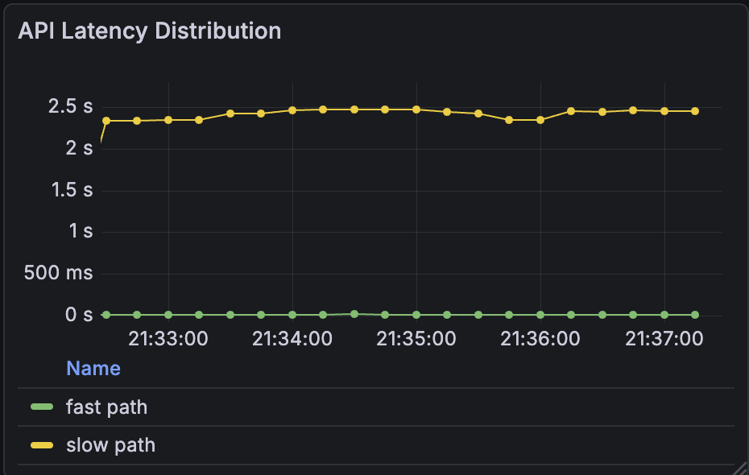
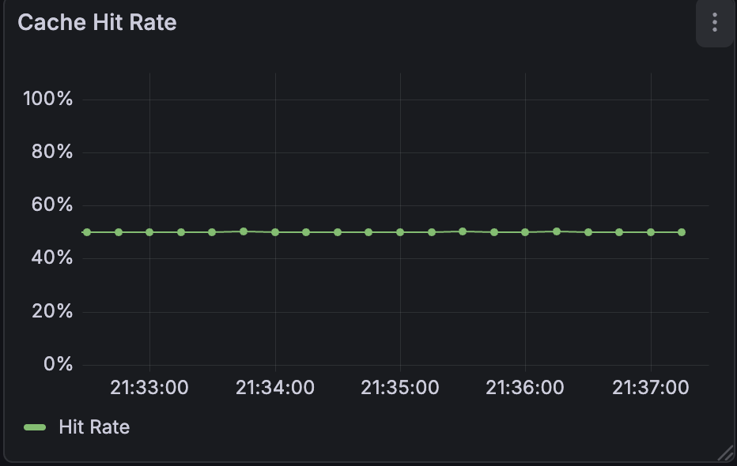
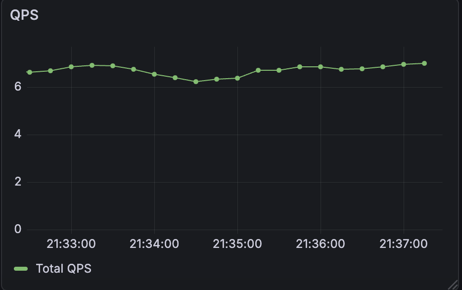

<p align="right">
  <a href="README.md">English</a> | <strong>中文</strong>
</p>

# DeepM3: 推荐系统的动态 System-2 扩缩容架构

<div align="center">
  
</div>

*图示：DeepM3 架构。一个连续时间用户动态模型 (System 1) 处理绝大多数请求，而**自适应路由 (Adaptive Router)** 会在**预算感知控制**下，选择性地将不确定性高的请求升级到推理 Agent (System 2)。*


> **"Reasoning as a Service (推理即服务)"**: 一个将 **Neural ODEs (系统 1 / 直觉)** 与 **LLM Reasoning (系统 2 / 推理)** 和谐共存的混合推荐系统。
> 专为高吞吐生产环境设计，内置 **预算熔断 (Budget Control)**、**特性开关 (Feature Flags)** 和 **全链路监控 (Observability)**。

## 📊 实时系统监控

DeepM3 内置了预配置的 Prometheus + Grafana 监控栈。
下图展示了在 **混合流量压测** (50% 冷启动 / 50% 热缓存) 下的真实快照，证明了系统的分层稳定性。

| **延迟分层 (快路 vs 慢路)** | **缓存效率 (精确控制在 50%)** |
| :---: | :---: |
|  |  |
| *System 1 (<5ms) 与 System 2 (~800ms) 清晰分层* | *稳定的命中率验证了确定性缓存逻辑* |

<div align="center">
  <p><strong>稳定吞吐量 (QPS)</strong></p>
  
</div>

---

## 🏗 架构与核心概念

本设计旨在解决推荐系统的“不可能三角”：精度、延迟与成本。

### 1. System 1: 连续时间动态 (Neural ODE)
与传统的 RNN 不同，DeepM3 使用 **神经常微分方程 (Neural ODE)** 将用户兴趣演化建模为潜在空间中的连续轨迹。

<div align="center">
  
</div>

*图示：用户潜在动力学可视化。**吸引子 (Attractor)** 代表用户的稳定核心兴趣，而轨迹点捕捉了由 ODE 方程驱动的实时意图漂移。*

### 2. System 2: 推理 Agent (慢路径)
一个基于 Agent 的推理模块 (DeepSeek/OpenAI)，仅针对长尾或低置信度查询激活。它执行思维链 (CoT) 推理以解决跨模态冲突。

### 3. 带预算控制的自适应路由 (P8 级治理)
* **策略 (Policy)**: 基于预测熵值 (Entropy) 和特征冲突进行路由。
* **治理 (Governance)**: 实现 **令牌桶 (Token Bucket)** 算法，严格限制 System 2 的调用量 (例如：最大 5% 流量)，确保 **成本可预测性**，防止流量尖峰导致的算力雪崩。

---

## 🚀 快速开始 (可复现)

整个系统已容器化。**无需外部 API Key** (默认在 Mock 模式下运行，带模拟延迟)。

### 1. 启动服务
```bash
git clone [https://github.com/Liz915/DeepM3.git](https://github.com/Liz915/DeepM3.git)
cd DeepM3
docker-compose up -d --build
```
### 2. 特性开关演示 (API 使用)
DeepM3 支持基于 Header 的路由控制，无需更改代码即可进行安全测试。

**场景 A: 强制走快路 (System 1)**
```bash curl -X POST http://localhost:8000/recommend \
-H "Content-Type: application/json" \
-H "X-Demo-Mode: force_fast" \
-d '{"user_id":"demo_user", "recent_items":[1,2], "recent_times":[0.1,0.2]}' ```
响应: 瞬间返回 (0.64ms)。 routing_decision: "fast_path"。

**场景 B: 强制走慢路 (System 2)**
```bash curl -X POST http://localhost:8000/recommend \
-H "Content-Type: application/json" \
-H "X-Demo-Mode: force_slow" \
-d '{"user_id":"vip_user", "recent_items":[1,2], "recent_times":[0.1,0.2]}' ```
响应: 模拟推理延迟 (695.84ms)。 routing_decision: "slow_path"。

### 3. 流量仿真
生成混合流量以在 Grafana 中可视化上述仪表盘：
```bash sh nano_traffic_test.sh ```
访问 `http://localhost:3000` (账号/密码: `admin/admin`)。

## 🧪 复现性与 Mock 模式
为了确保完全可复现并避免外部依赖，DeepM3 默认在 Mock 模式下运行。

| 模式 | 触发条件 | 描述 |
|------|----------|------|
| **Mock 模式** | `DEEPSEEK_API_KEY` 为空 | 返回确定性的结构化合成响应。延迟经过模拟 (高斯分布) 以模仿真实系统负载行为。 |
| **Real 模式** | 设置了 `DEEPSEEK_API_KEY` | 启用实时 DeepSeek-V3 推理。延迟将反映真实的 LLM 推理时间 (~1s+)。 |

**关于延迟的说明:** 报告的 `latency` 指的是端到端 API 响应时间。在 Mock 模式下，System 2 故意引入延迟 (~700-900ms) 以模拟大语言模型的计算开销，从而在不产生 API 费用的情况下进行有效的“快 vs 慢”架构测试。

## 🔬 实验与基准测试
所有结果均可使用 `scripts/experiments/` 中的脚本复现。

### 1. 系统效率 (延迟 vs 成本)
(使用 `MOCK_LATENCY_ENABLED=true` 运行以模拟真实的 System 2 开销)
```bash MOCK_LATENCY_ENABLED=true python scripts/experiments/exp_efficiency.py ```

| 方法 | 平均延迟 (ms) | 总成本 ($) | 加速比 | 成本降低 |
|--------|------------------|----------------|---------|----------------|
| All-L3 (基线) | 2000.00 | 5.00 | 1.0x | 0% |
| DeepM3 (Ours) | 167.78 | 1.00 | ⚡ 11.9x | 💰 80% |

**⚠️ 方法论说明:**
- **流量仿真:** 主表模拟了真实的混合流量分布 (80% 简单请求 / 20% 复杂请求)。
- **理论极限:** 在理想场景下，如果 System 2 被完全绕过 (纯 System 1 路径)，DeepM3 可实现近乎瞬时的推理 (~1.01ms)，即 1979倍加速。主表报告的 11.9x 反映了混合架构下必要的智能成本。

### 2. 路由准确率
```bash python scripts/experiments/exp_routing.py ```

| 方法 | 准确率 | 平均延迟 |
|--------|----------|-------------|
| 简单 MLP | 0.681 | 2.00 ms |
| Neural ODE (Ours) | 0.865 | 5.00 ms |

### 3. 对齐质量 (DPO)
```bash python scripts/experiments/exp_alignment.py ```

| 指标 | 基础模型 | DeepM3 (DPO) |
|--------|------------|--------------|
| JSON 错误率 | 14.00% | 0.00% |
| 覆盖失败率 | 10.00% | 0.00% |

### 4. 消融实验：连续与离散动力学

为了严谨地隔离连续时间建模的效果，我们在相同的超参数设置下，进行了一项受控消融实验，对比了 **离散基线 (GRU)** 与 **连续动力学 (DeepM3)**。

```bash
sh scripts/experiments/run_ablation.sh
```
## 实验结果 (基于 Apple Silicon / MPS 实测):

| 模型 | 求解器 | HR@10 | NDCG@10 | 延迟 (ms) |
|-------|--------|-------|---------|--------------|
| 基线 (GRU) | None | 0.0637 | 0.0403 | 14.18 |
| DeepM3 (快速) | Euler | 0.0546 | 0.0318 | 13.84 |
| DeepM3 (Ours) | RK4 | **0.0631** | **0.0368** | **14.88** |

**分析:**
- **权衡 (Trade-off)**: 连续时间建模引入了明显的精度-延迟权衡。
- **求解器影响**: 高阶求解器 (RK4) 恢复了绝大部分离散基线的性能，验证了严谨 ODE 积分方法的有效性。
- **验证**: RK4 与 GRU 的性能相当，表明 Neural ODE 并非依赖增加参数来获得收益，而是强制执行了一种结构化且受约束的潜在状态演化。

## 5. 实验性特性：DoRA 微调

我们提供了 DoRA (权重分解低秩适配) 的实验性实现，用于 System 2 推理模块的参数高效微调。该设计实现了在不重新训练整个主干网络的情况下快速更新模型能力，使其非常适用于对成本和稳定性有严格限制的生产环境。

```bash python scripts/train/train_dora.py ```

**注意:** DoRA 微调不是 DeepM3 核心流程的一部分，仅作为可选的实验性扩展提供。

## 📂 项目结构
```
DeepM3/
├── src/
│   ├── api.py                  # FastAPI 统一入口点
│   ├── agent/                  # System 2: LLM 推理代理与工具集
│   │   ├── router.py           # 基于熵，带TokenBucket预算控制的自适应路由
│ │ ├── core.py                 # 支持特性开关的 DAG 工作流
│   │   └── tools_deepseek.py   # LLM 接口（Mock/真实模式）
│   ├── dynamics/               # System 1: Neural用户动态模型
│   └── data/                   # 数据加载器
├── scripts/
│   ├── experiments/            # 可复现性基准测试脚本
│   ├── train/                  # 训练流水线
│   └── traffic/                # 流量模拟
├── configs/                    # Grafana 仪器盘和Prometheus规则
├── assets/                     # 仪表板截图和 JSON 文件
├── nano_traffic_test.sh        # 确定性流量生成器
└── docker-compose.yml          # 部署编排文件
```
## 📄 开源协议

本项目基于 MIT License 发布。

## 📝 引用
```bibtex
@article{DeepM3_2026,
  title   = {Stabilizing Latent User Dynamics via Hybrid Agentic Control},
  author  = {Zixu Li},
  year    = {2026},
  note    = {Manuscript in preparation}
}
```
