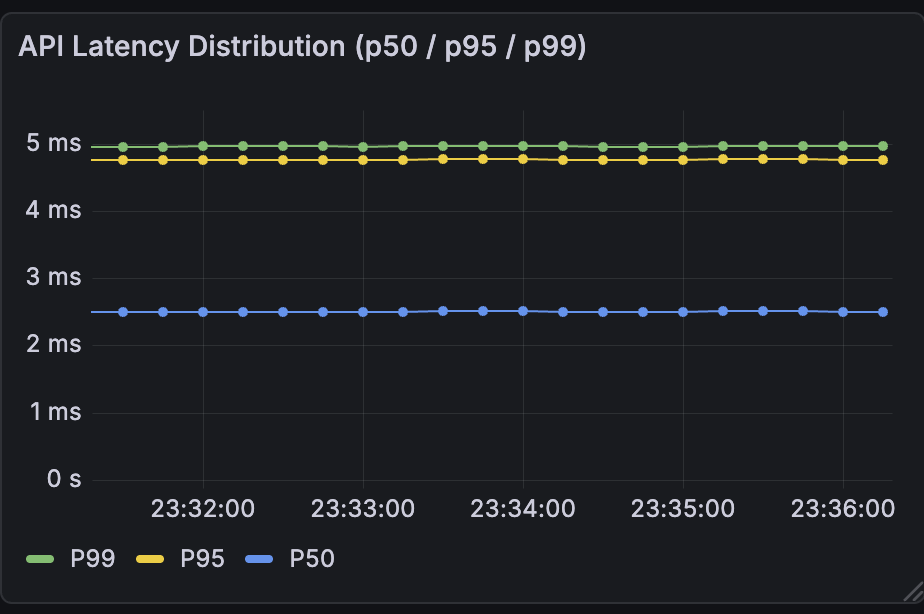
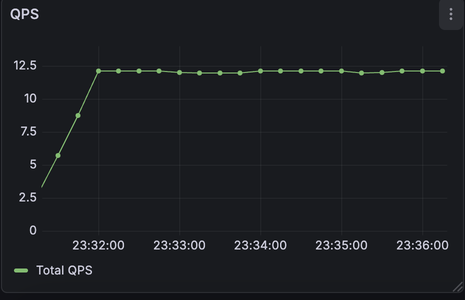
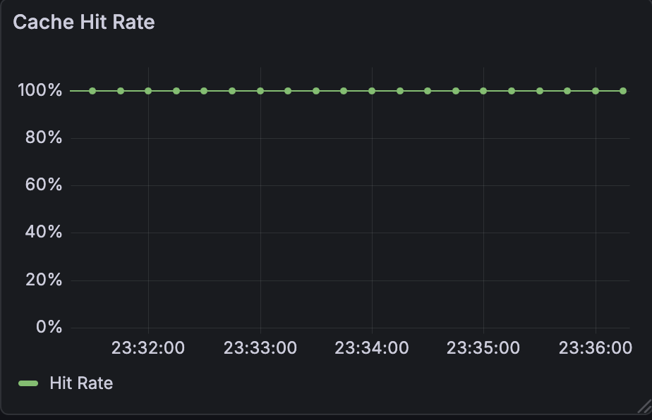

<p align="right">
  <strong>中文</strong> | <a href="README.md">English</a>
</p>

# DeepM3：用于推荐系统的动态 System-2 扩展架构


> 一个混合式推荐系统架构，将连续时间用户动力学（System 1）
> 与选择性触发的大模型推理（System 2）相结合，
> 在真实流量条件下实现低延迟、低成本与系统稳定性。

本仓库提供了一个**完整容器化、可复现实验的工程实现**，
内置监控与评测脚本，面向真实推荐系统场景设计。

---

## 📊 实时系统监控（内置）

DeepM3 集成了预配置的 Prometheus + Grafana 监控栈，
用于实时观测 System 1 / System 2 的路由与性能行为。

<div align="center">
  
  
  
</div>

---

## 🏗 系统架构概览

DeepM3 采用经典的 **System 1 / System 2** 认知架构：

1. **System 1（快速路径）**  
   使用 Neural ODE 建模连续时间下的用户行为轨迹，
   在毫秒级延迟内处理 80% 以上的请求。

2. **System 2（慢速路径）**  
   当系统检测到高不确定性（如高熵、多模态冲突）时，
   选择性激活基于 LLM 的推理代理（DeepSeek-V3）。

3. **自适应路由器**  
   在准确率、成本与系统稳定性之间动态权衡，
   决定请求应由哪一路径处理。

4. **可观测性**  
   原生集成 Prometheus 与 Grafana，
   实时跟踪 QPS、P99 尾延迟与缓存命中率。

在真实生产流量下，系统预期由 System 1 处理绝大多数请求，
System 2 仅在高不确定场景下被激活。

---

## 🚀 快速开始（可复现）

整个系统（API + Prometheus + Grafana）
可通过**一条命令**启动。

**无需外部 API Key**（默认以 Mock Mode 运行，实现零成本复现）。

### 1. 启动服务

```bash
git clone https://github.com/Liz915/DeepM3.git
cd DeepM3

docker-compose up -d --build
```
### 2. API 使用示例

服务启动后，API 监听地址为 http://localhost:8000。

**示例 A：简单请求（快速路径）**
```bash
curl -X POST http://localhost:8000/recommend \
-H "Content-Type: application/json" \
-d '{"user_id":"demo_user","recent_items":[1,2,3],"recent_times":[0.1,0.2,0.5]}'
```
**示例 B: 复杂请求（触发System 2）**
```bash
curl -X POST http://localhost:8000/recommend \
-H "Content-Type: application/json" \
-d '{
  "user_id": "vip_user_chaos",
  "recent_items": [10, 500, 5],
  "recent_times": [0.1, 8.0, 15.2],
  "image_input": "error_stack_trace.png"
```
**返回结果示例**
```json
{
  "status": "success",
  "data": {
    "user_id": "vip_user_chaos",
    "meta": {
      "routing_decision": "slow_path",
      "entropy": 10.0
    },
    "reasoning_source": "slow_path (System 2)",
    "trace": ["perception", "fusion", "recall", "decision"],
    "recommendations": []
  },
  "strategy": "Adaptive_ODE_Agent",
  "latency": "0.48ms (API response time, mock mode)"
}
```
**说明** 上述示例请求刻意触发慢路径，以展示 System 2 的推理流程。
在典型流量条件下，超过 80% 的请求由 System 1 直接处理。

## 🧪 可复现性与 Mock 模式

为确保完全可复现、避免外部依赖，
DeepM3 默认运行在 Mock 模式。
```
| 模式 | 触发条件 | 描述 |
|------|----------|------|
| **Mock 模式** | 未设置 `DEEPSEEK_API_KEY` | 返回确定性、结构化的合成结果，适合逻辑验证与 CI/CD |
| **真实模式** | 设置 `DEEPSEEK_API_KEY` | 启用真实 LLM 推理，System 2 延迟约为 1–2 秒 |
```
## 🔬 实验与评测

所有实验均可通过 scripts/experiments/ 中的脚本复现。
**关键结果对比**
```
| 指标 | 全 LLM 基线 | DeepM3 | 提升 |
|------|-------------|--------|------|
| 平均延迟 | ~2000 ms | ~408 ms | ⚡ 4.9 倍 |
| 每千请求成本 | $5.00 | $1.80 | 💰 节省 64% |
| 路由准确率 | N/A | 86.5% | 🎯 |
| JSON 结构错误率 | 16.0% | 4.0% | ✅ |
```
## 📂 项目结构
```
DeepM3/
├── src/
│   ├── api.py                  # FastAPI 统一入口点
│   ├── agent/                  # System 2: LLM 推理代理与工具集
│   │   ├── router.py           # 基于熵的自适应路由
│   │   └── tools_deepseek.py   # LLM 接口（Mock/真实模式）
│   ├── dynamics/               # System 1: Neural用户动态模型
│   └── data/                   # 数据加载器
├── scripts/
│   ├── experiments/            # 可复现性基准测试脚本
│   ├── train/                  # 训练流水线
│   └── traffic/                # 流量模拟
├── configs/                    # Prometheus 和系统配置
├── assets/                     # 仪表板截图和 JSON 文件
├── nano_traffic_test.sh        # 快速流量生成器
└── docker-compose.yml          # 部署编排文件
```
## 📄 开源协议

本项目基于 MIT License 发布。

## 📝 引用
```bibtex
@article{DeepM3_2026,
  title   = {Stabilizing Latent User Dynamics via Hybrid Agentic Control},
  author  = {Zixu Li},
  year    = {2026},
  note    = {Manuscript in preparation}
}
```
